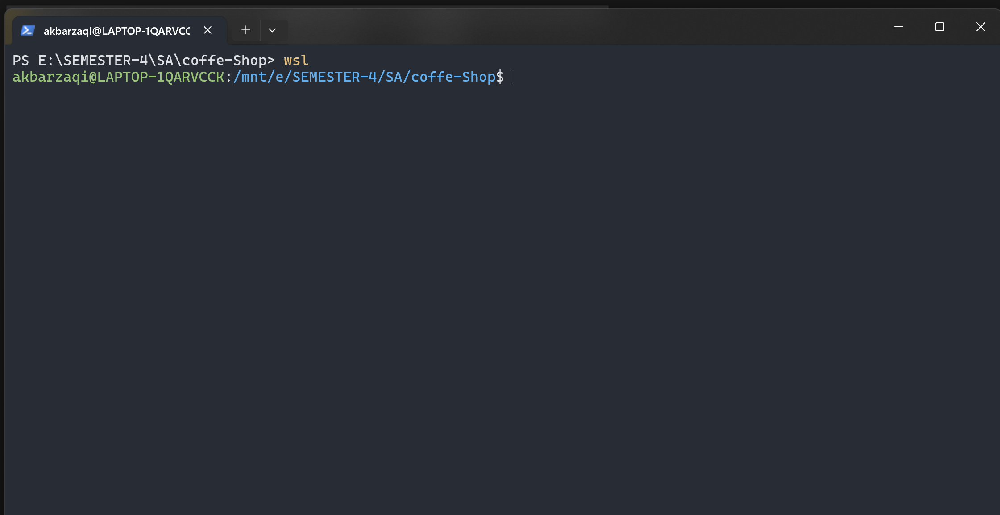
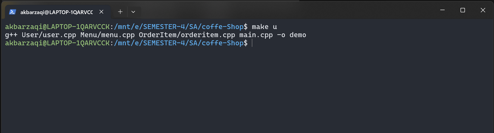
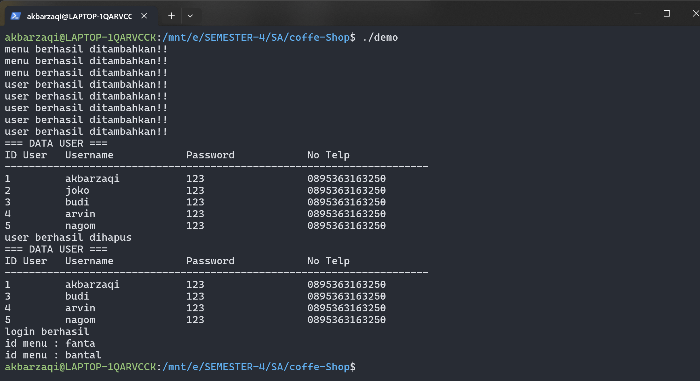

# Cara Clone dan Push ke Repository

## 1. Clone Repository

- Untuk meng-clone repository ke komputer lokal, gunakan perintah berikut di terminal atau command prompt:

      git clone https://github.com/SDATA-TEAM/tugas-project.git

- Setelah berhasil di-clone, pindah ke direktori repository dengan perintah:

      cd tugas-project

## 2. Menambahkan Perubahan dan Push ke Repository (kalau ada perubahan terus mau di up digithub)

### a. Menambahkan Perubahan ke Branch Utama (buat branch baru ajaa biar ga bentrok, cara nya di no 3)

- Tambahkan file yang telah diubah ke staging area:

      git add .

- Commit perubahan dengan pesan yang relevan:

      git commit -m "Pesan commit Anda"

- Push perubahan ke branch main:

      git push origin master

## 3. Push menggunakan branch baru

Apabila Anda ingin membuat perubahan tanpa langsung memengaruhi branch utama (master), ikuti langkah berikut:

### a. Membuat Branch Baru

- Buat branch baru dengan nama yang sesuai:

      git branch nama-branch-baru

- Pindah ke branch yang baru dibuat:

      git checkout nama-branch-baru

### b. Menambahkan Perubahan dan Push ke Branch Baru

- Tambahkan file yang telah diubah ke staging area:

      git add .

- Commit perubahan dengan pesan yang relevan:

      git commit -m "Pesan commit untuk branch baru"

- Push perubahan ke branch baru:

      git push origin nama-branch-baru

## 4. Membuat Pull Request

Jika repository ini menggunakan metode kolaborasi dengan pull request, lakukan langkah berikut setelah push ke branch baru:

    * Buka repository di GitHub: tugas-project.
    * Klik tombol Compare & pull request.
    * Tinjau perubahan Anda, tambahkan komentar jika diperlukan, lalu ajukan pull request.

## 5. Notes

    Gunakan nama branch yang deskriptif sesuai perubahan yang dilakukan (misal : addSearchMenu)
    Selalu cek perubahan Anda sebelum melakukan commit dan push.

# Cara Compile dan Menjalankan Program

### Cara Compile

- Install wsl dulu diwindows kalian, jika sudah jalan kan comand wsl diterminal kalian
      

- Jalankan perintah berikut di terminal kalian setelah melakukan perubahan:

      make u
  

### Cara Menjalankan Program

- Setelah proses kompilasi selesai, jalankan perintah berikut untuk menjalankan program:

      ./demo
  

